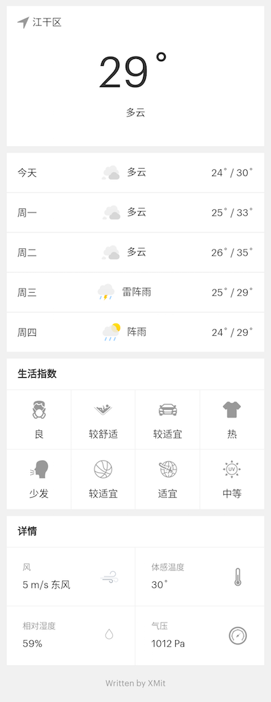

# 至简天气

### 项目说明

微信小程序：当地天气预报与其它城市天气的搜索

### 目录结构

- /pages/index — 存放项目主页面相关文件
- /pages/search — 存放项目搜索页面相关文件

### 项目截图



### 项目目录

```
├── README.md
├── app.js
├── app.json
├── app.wxss
├── pages
│   ├── index
│   │   ├── image
│   │   │   ├── 100.svg
│   │   │   ├── 101.svg
│   │   │   ├── 103.svg
│   │   │   ├── 104.svg
│   │   │   ├── 200.svg
│   │   │   ├── 201.svg
│   │   │   ├── 300.svg
│   │   │   ├── 301.svg
│   │   │   ├── 302.svg
│   │   │   ├── 304.svg
│   │   │   ├── 305.svg
│   │   │   ├── 306.svg
│   │   │   ├── 308.svg
│   │   │   ├── 310.svg
│   │   │   ├── 400.svg
│   │   │   ├── 401.svg
│   │   │   ├── 402.svg
│   │   │   ├── 500.svg
│   │   │   ├── 501.svg
│   │   │   ├── 502.svg
│   │   │   ├── 503.svg
│   │   │   ├── 900.svg
│   │   │   ├── cloud.svg
│   │   │   ├── detail
│   │   │   │   ├── barometer.svg
│   │   │   │   ├── humidity.svg
│   │   │   │   ├── temperature.svg
│   │   │   │   └── windy.svg
│   │   │   ├── life
│   │   │   │   ├── air.svg
│   │   │   │   ├── comf.svg
│   │   │   │   ├── cw.svg
│   │   │   │   ├── drsg.svg
│   │   │   │   ├── flu.svg
│   │   │   │   ├── sport.svg
│   │   │   │   ├── trav.svg
│   │   │   │   └── uv.svg
│   │   │   └── location
│   │   │       └── location-arrow.svg
│   │   ├── index.js
│   │   ├── index.json
│   │   ├── index.wxml
│   │   └── index.wxss
│   ├── logs
│   │   ├── logs.js
│   │   ├── logs.json
│   │   ├── logs.wxml
│   │   └── logs.wxss
│   └── search
│       ├── index.js
│       ├── index.json
│       ├── index.wxml
│       ├── index.wxss
│       └── json.js
├── project.config.json
├── screenshot
│   ├── pay.png
│   ├── qrcode.jpg
│   └── screenshot.png
└── utils
    └── util.js
```

### 扫码使用


### 赞助我

如果觉得这些内容不错，请我喝杯咖啡吧。


